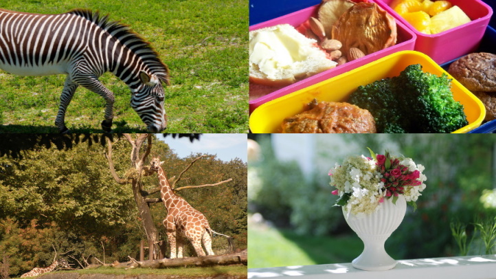
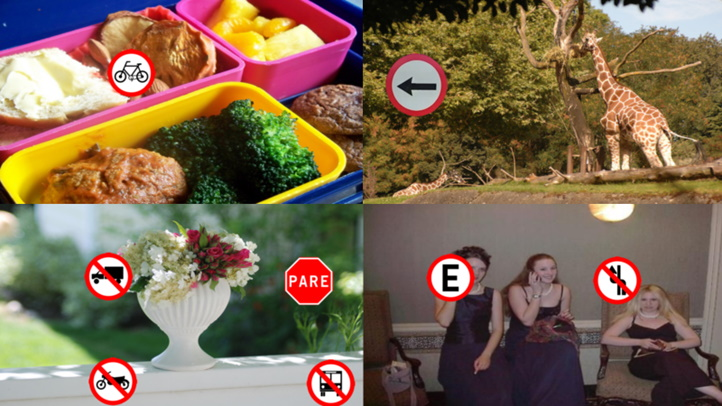
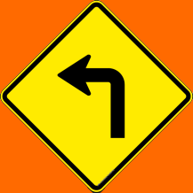
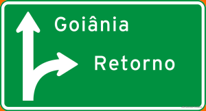
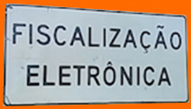
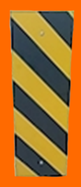

# Final Thesis Project - Creating Datasets
 
This Git contains the code related to the generation of the datasets used in the Final Thesis Work: **"Convolutional neural networks in the detection and classification of brazilian traffic signs"**

The full article can be accessed here: [PDF Article](https://drive.google.com/file/d/1hccMbV0pJtdHe3xxYjwE9V5QkzNtdWnn/view?usp=share_link)

Three sets of data were generated:

- simpleDataset: set with a total of 657 images (382 artificial + 275 real ones) and 15 classes
- normalDataset: set with a total of 4.022 images (3.747 artificial + 275 real ones) and 242 classes
- hugeDataset: set with a total of 67.655 images (67.380 artificial + 275 real ones) and 242 classes

The datasets with their respective annotations are available for download [here](https://drive.google.com/drive/folders/1-GTAjtc_tkahRe-0zcQx3Kfso2R_0Nq7?usp=sharing) via Google Drive.

The file [creatingTrainingImages.ipynb](https://github.com/JPVercosa/Final-Thesis-Dataset/blob/main/creatingTrainingImages.ipynb) contains the algorithm used to generate the images artificially and which also concatenates the annotations of the original images ([annotations.json](https://github.com/JPVercosa/Final-Thesis-Dataset/blob/main/data/annotations.json)) with the artificially generated annotations. For it to work correctly it is necessary that the background images are in a folder in the root directory called `coco_dataset` and that the `ArtificialSamples` and `orangeTemplates` folders exist in the `data` directory.

The images generated by the algorithm will be saved in the `ArtificialSamples` folder, and the `orangeTemplates` folder must contain the traffic sign templates that will be pasted over the background images.

## Example of background images: 

## Example of artificially generated images:

## Traffic Sign templates:

The background images are in the public domain and have been filtered from the [2017 Train images [118K/18GB]] set (https://cocodataset.org/#download) set.
As images are created and labeled from the selected templates, from the `orangeTemplates` folder which can also be found [in this Drive](https://drive.google.com/drive/folders/1-GTAjtc_tkahRe-0zcQx3Kf2R_0Nq7).
The one chosen for the background color in the program [paint.net](https://www.getpaint.net/) has the values RGB(255, 16, 0) and HSV(24,100,100), but when orange is recognized by open.cv the HSV value is HSV(12,255,255), due to the different interval limits
